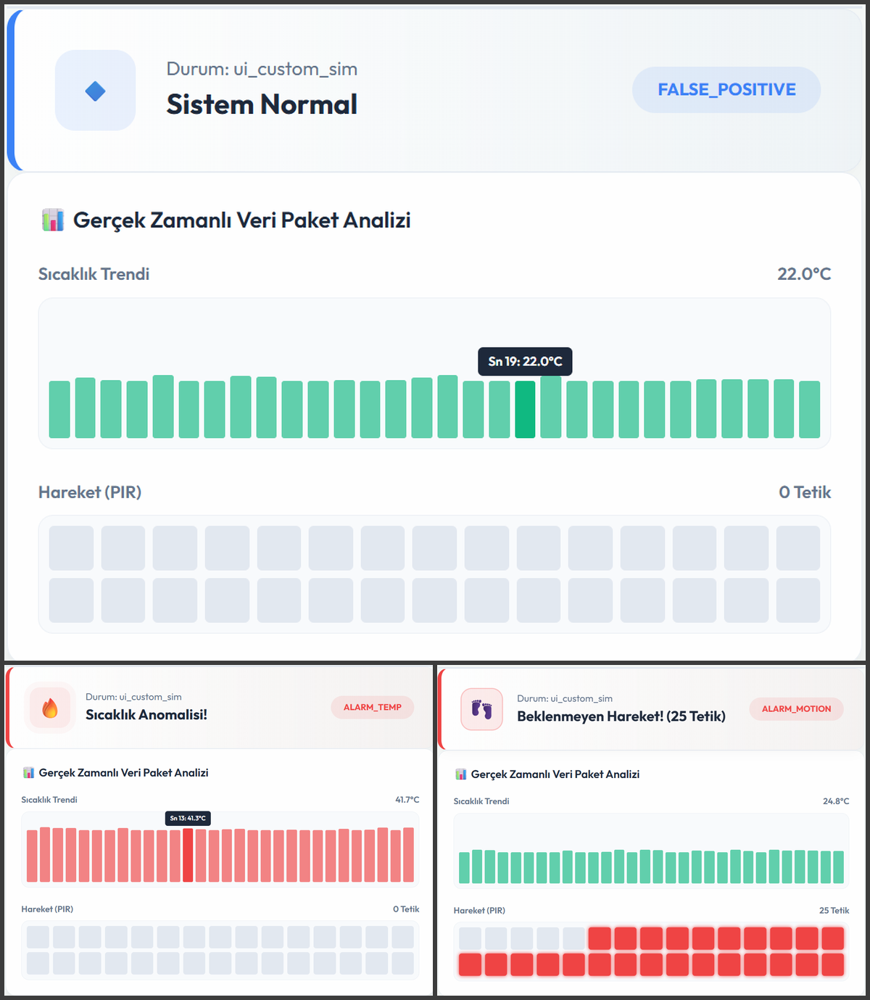
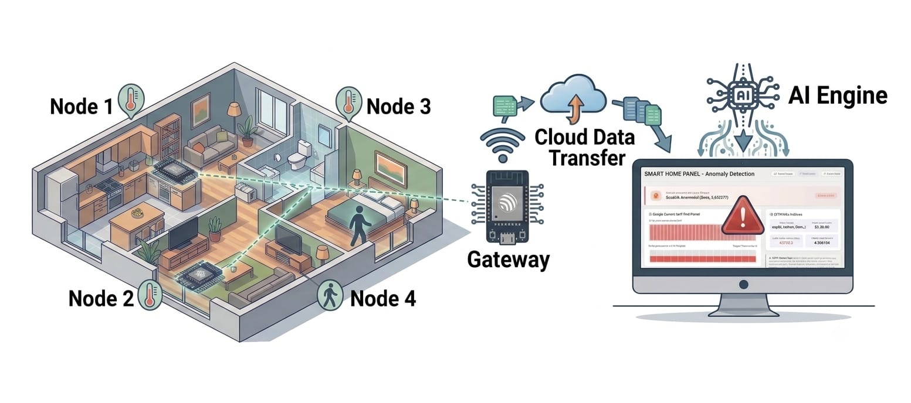

# 🏠 Hierarchical IoT-Based Smart Home System with Edge-Level Anomaly Detection

[](https://www.espressif.com/)
[](https://www.freertos.org/)
[](https://dotnet.microsoft.com/)
[](https://react.dev/)

This repository contains the full-stack source code, hardware architecture, and firmware implementation for a **Hierarchical Intelligent Smart Home Automation and Anomaly Detection System**. Developed as a Senior Graduation Project, the system combines real-time embedded systems, low-power IoT mesh topologies, edge computing algorithms, and a comprehensive cloud dashboard.

---

## 📌 Project Overview & System Architecture

The core philosophy of this project is to move computational intelligence closer to the data source (Edge Computing) to reduce cloud data overhead and improve response times, while ensuring absolute smart home security.

```
       +------------------+             +-------------------+
       |   ESP32 Node 1   |             |   ESP32 Node 2    |
       |  (Motion/Sensor) |             |  (Motion/Sensor)  |
       +--------+---------+             +---------+---------+
                |                                 |
                | (BLE / Button Triggered)        |
                +----------------+----------------+
                                 |
                                 v
                      +--------------------+
                      |  ESP32-S3 Bridge   |  <-- Z-Score Edge Anomaly Detection
                      +----------+---------+
                                 |
                                 | (HTTP POST / Webhook / Wi-Fi)
                                 v
                      +--------------------+
                      |  .NET Core Backend |
                      +----------+---------+
                                 |
                                 v
                      +--------------------+
                      |  React Web App UI  |
                      +--------------------+
```

### 🔑 Key Features
*   **Hierarchical IoT Mesh & Network Bridge:** Decentralized edge architecture using multi-node configurations (**ESP32-S3** and **ESP32 WROOM**).
*   **Edge-Level Anomaly Detection:** Real-time mathematical data analysis utilizing **Z-Score algorithms** calculated directly on the microcontrollers to detect unusual patterns (sensor faults, unexpected environmental shifts).
*   **On-Demand Power Management:** Motion data and heavy communications are activated dynamically via **User Button Press Events** rather than periodic polling, ensuring maximum power efficiency and support for deep-sleep cycles.
*   **Dual-Protocol Communication:** Seamless data bridging using **Bluetooth Low Energy (BLE)** for inter-node communication and **Wi-Fi (HTTP POST/Webhooks)** for cloud delivery.
*   **Enterprise Full-Stack Ecosystem:** Robust backend built with **C# (.NET Core)** leveraging design patterns like *Specification Pattern*, combined with an interactive user control center built with **React** and **TypeScript**.

---

## 📸 System Previews (UI & Hardware)

Here are the system layouts, circuit diagrams, and web application dashboards located under the `View/` directory.

| System Dashboard | Hardware Prototype & Circuitry |
| :---: | :---: |
|  |  |
| *Real-time metrics, anomaly alert panels, and device control logs.* | *ESP32-S3 bridge node connected with peripheral sensor arrays.* |

*(Note: Please rename the file paths inside the `View/` folder placeholder links above to match your actual image file names.)*

---

## 🛠 Tech Stack & Hardware Components

### Embedded & Hardware
*   **Microcontrollers:** ESP32-S3, ESP32-WROOM-32E
*   **Operating System:** FreeRTOS (Task scheduling, Mutexes, and Queue Management)
*   **Sensors & Actuators:** Motion Sensors, Environmental State Sensors, Mechanical Input Keys
*   **Protocols:** BLE (Bluetooth Low Energy), Wi-Fi, HTTP/JSON Webhooks

### Cloud & Software Web Architecture
*   **Backend:** .NET Core, C# Web API (Clean Architecture / Specification Pattern)
*   **Frontend:** React.js, TypeScript, TailwindCSS, Chart.js (or Recharts)
*   **Database/Storage:** Entity Framework Core

---

## 🧠 Core Algorithmic Focus: Z-Score on Edge

Instead of routing raw streams of data to the cloud, the **ESP32-S3 Bridge** analyzes streaming data locally. It maintains a rolling standard deviation ($\sigma$) and mean ($\mu$). 

$$	ext{Z-Score} = rac{X - \mu}{\sigma}$$

If the computed absolute Z-Score exceeds a predetermined threshold (e.g., $|Z| > 2.5$), the system identifies this as an **anomaly (irregular state)**, intercepts the event chain, flags it into the JSON payload, and forces an immediate high-priority warning trigger to the .NET Backend server.

---

## 🚀 Installation & Getting Started

### 1. Firmware Setup (ESP32 / ESP32-S3)
1. Open the embedded directory using **VS Code (with PlatformIO)** or **Arduino IDE**.
2. Configure your Wi-Fi credentials and API Webhook URL endpoints in the `config.h` file:
   ```cpp
   const char* ssid = "YOUR_WIFI_SSID";
   const char* password = "YOUR_WIFI_PASSWORD";
   const char* serverUrl = "http://your-backend-ip:5000/api/metrics/webhook";
   ```
3. Flash the peripheral node firmware to the **ESP32** and the gateway bridge firmware to the **ESP32-S3**.

### 2. Backend API Setup (.NET Core)
1. Navigate to the backend solution folder:
   ```bash
   cd Backend/SmartHomeAPI
   ```
2. Update connection strings in `appsettings.json` if required.
3. Run the migrations and launch the web server:
   ```bash
   dotnet ef database update
   ```
   ```bash
   dotnet run
   ```

### 3. Frontend Dashboard Setup (React + TS)
1. Navigate to the frontend directory:
   ```bash
   cd Frontend/smarthome-ui
   ```
2. Install npm dependencies:
   ```bash
   npm install
   ```
3. Start the local development web server:
   ```bash
   npm run dev
   ```

---

## 🧑‍💻 Author & Acknowledgments

*   **Furkan Baran** - Fourth-Year Computer Engineering Student.
*   Special thanks to my graduation project advisor (**Hoca**) for providing valuable feedback, structural architectural guidance, and reporting criteria improvements throughout the project lifecycle.
